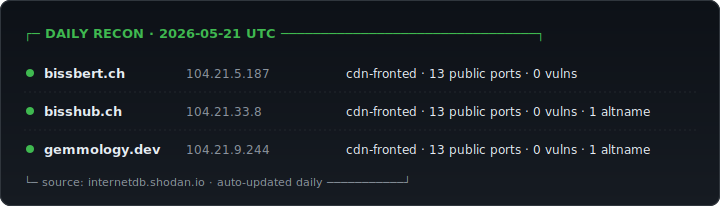
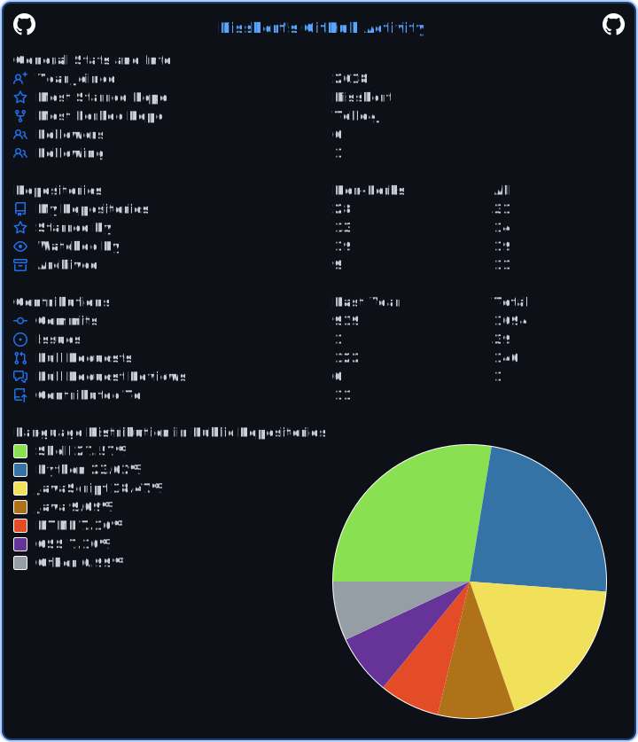

---

## Currently

Cybersecurity engineer on critical electricity infrastructure — OT network visibility, asset discovery, detection-as-code. Based in Switzerland.

## Selected work

**Security & systems**
- **[POSIX-hardening](https://github.com/Bissbert/POSIX-hardening)** — 21-script Debian hardening toolkit with auto-rollback and SSH lockout prevention.
- **[posix-ids](https://github.com/Bissbert/posix-ids)** — zero-dep Linux IDS that pipes alerts into Splunk.
- **[splunk-security-alerts](https://github.com/Bissbert/splunk-security-alerts)** — detection-as-code framework for production Splunk environments.
- **[zbx-cli](https://github.com/Bissbert/zbx-cli)** — pure-shell Zabbix client for locked-down hosts.
- **[topdesk-cli](https://github.com/Bissbert/topdesk-cli)** — shell client for Topdesk ITSM automation.
- **[toolbox.sh](https://github.com/Bissbert/toolbox.sh)** — POSIX-shell framework for Git-style CLIs, JSON-driven scaffolding.

**Beyond work**
- **[minecraft-litematica](https://github.com/Bissbert/minecraft-litematica)** — SDF math meets Minecraft: composable 3D primitives + boolean ops generating Litematica schematics.
- **[obsidianMathsExecutor](https://github.com/Bissbert/obsidianMathsExecutor)** — Obsidian plugin that executes prepared LaTeX maths inside your vault.
- **[jewlarray.ch](https://jewlarray.ch)** — gemmology bench: faceting, identification, retail.

## Daily recon

Nightly Shodan-InternetDB sweep of my own domains, rendered as a static SVG. No external dashboard, no third-party hosting — generated by a GitHub Action and committed back.

## Stack

  

## Activity

  

  

## Elsewhere

- [LinkedIn](https://www.linkedin.com/in/fabian-moor-2930001b6/)
- [bissbert.ch](https://bissbert.ch) — write-ups (intermittent)
- [jewlarray.ch](https://jewlarray.ch) — gemmology shop
